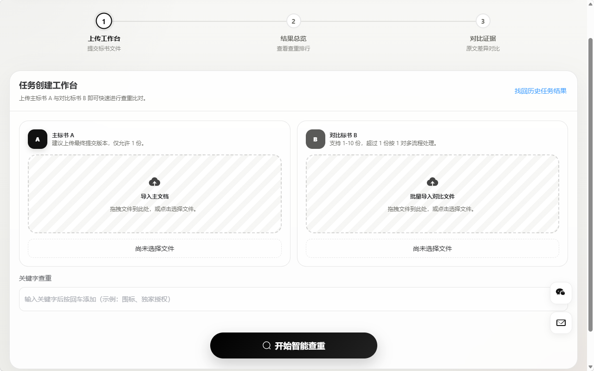
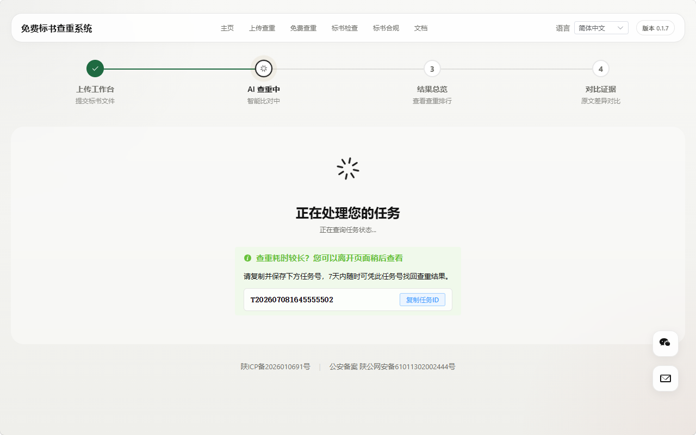
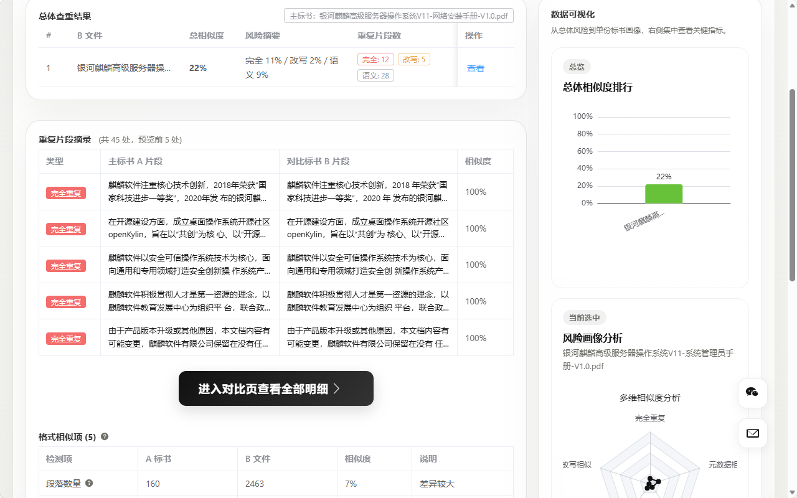
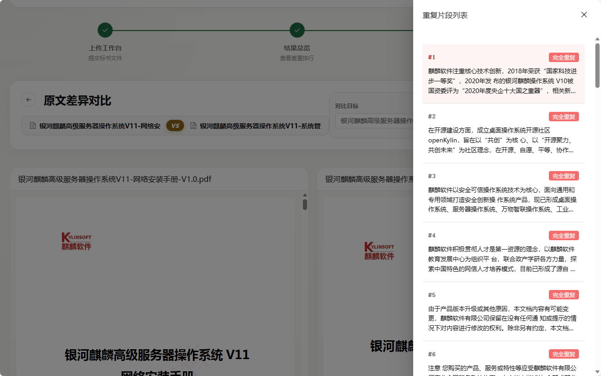

# BSCC 标书查重系统

BSCC 是一个面向标书场景的智能查重与风险研判系统。系统支持上传主标书与多份对比标书，自动完成文本解析、重复检测、结果排行、可视化分析、详情解锁与任务找回，并提供独立的隐藏式运营后台用于配置支付、站点信息和运营策略。

## 在线体验与视频说明

- 在线体验地址：[https://biaoshu.mxitx.com](https://biaoshu.mxitx.com)
- 视频使用说明：[点击查看 B 站视频教程](https://www.bilibili.com/video/BV1mUMG6qEpp/?share_source=copy_web&vd_source=89e7a3357f2693f28ebb4596e1b8a502)  
  [](https://www.bilibili.com/video/BV1mUMG6qEpp/?share_source=copy_web&vd_source=89e7a3357f2693f28ebb4596e1b8a502)

## 截图展示

### 文件上传界面


### 对比等待界面



### 查重结果界面



### 重复对比界面



## 项目概览

- 前端基于 `Vue 3`、`Vite`、`Element Plus`、`ECharts`
- 后端基于 `FastAPI`、`SQLite`
- 支持 `PDF`、`DOCX` 文档解析与对比
- 支持支付宝和微信 Native 支付解锁
- 支持按任务号、订单号或联系方式找回历史结果
- 支持后台配置首页标题、特点标签、客服信息、支付参数、促销活动和查重阈值

## 功能清单

### 用户端

- 上传主标书 A 与多份对比标书 B 发起查重任务
- 在等待页显式展示任务 ID，支持离开页面后回来继续查看
- 在结果页查看总体相似度排行、重复片段摘录和数据可视化
- 查看格式相似项、元数据对比、关键字命中等细分结果
- 对未支付任务提供免费预览，并通过支付弹窗解锁完整详情
- 支持支付宝、微信两种支付通道
- 支持文档说明页，向普通用户介绍系统使用方式

### 运营后台

- 通过隐藏路由 `/admin` 进入后台
- 管理员登录、鉴权与密码修改
- 首页运营总览，查看订单、任务与日志摘要
- 订单列表、任务列表、操作日志支持真分页、模糊搜索、日期范围筛选
- 任务支持重试、延长保留期、批量物理删除
- 删除任务时同步物理清理数据库关联数据和磁盘文件
- 配置站点标题、首页特点标签、系统公告、客服邮箱、客服微信二维码
- 配置查重阈值、结果保留天数、支付开关与支付参数
- 配置促销活动，包括原价、优惠价、截止时间、倒计时与营销文案

## 目录结构

```text
BSCC/
├─ frontend/                     # Vue 3 前端应用
│  ├─ src/components/            # 通用组件
│  ├─ src/views/                 # 页面视图
│  ├─ src/services/              # 前端 API 封装
│  ├─ src/utils/                 # 价格/倒计时等工具函数
│  └─ public/                    # 静态资源
├─ backend/                      # FastAPI 后端应用
│  ├─ app/routers/               # 路由层
│  ├─ app/services/              # 业务服务层
│  ├─ app/utils/                 # 通用工具
│  ├─ tests/                     # 后端测试
│  ├─ .env.example               # 支付与站点配置示例
│  └─ cleanup.py                 # 历史数据清理脚本
├─ miniprogram/                  # 微信小程序原生前端
├─ docs/                         # 设计、需求、接口等文档
│  └─ images/                     # README 截图展示资源
└─ README.md
```

## 运行环境

### 基础要求

- `Python 3.11` 或更高版本
- `Node.js 18` 或更高版本
- `npm 9+`

### 后端依赖

- `fastapi`
- `uvicorn[standard]`
- `python-multipart`
- `python-docx`
- `pypdf`
- `httpx`
- `python-alipay-sdk`
- `python-dotenv`

### 前端依赖

- `vue`
- `vue-router`
- `element-plus`
- `echarts`
- `vue-echarts`
- `vue-pdf-embed`
- `docx-preview`
- `qrcode`
- `mark.js`

## 快速启动

### 1. 克隆项目

```bash
git clone <your-repo-url>
cd BSCC
```

### 2. 启动后端

推荐在 Windows 下使用虚拟环境，避免系统 Python 与 `WindowsApps` 别名冲突。

```powershell
cd backend
python -m venv .venv
.\.venv\Scripts\Activate.ps1
python -m pip install -r requirements.txt
python -m app.main
```

默认地址：

- API 服务：`http://127.0.0.1:8000`
- 健康检查：`http://127.0.0.1:8000/api/health`

如果你已经激活虚拟环境，安装依赖时建议统一使用：

```powershell
python -m pip install -r requirements.txt
```

### 3. 启动前端

```bash
cd frontend
npm install
npm run dev
```

默认地址：

- 前台页面：`http://127.0.0.1:5173`
- 后台入口：`http://127.0.0.1:5173/admin`
- 使用说明页：`http://127.0.0.1:5173/docs`

## 支付与环境配置

后端已提供配置模板：`backend/.env.example`

建议复制为本地环境文件后再填写：

```powershell
cd backend
Copy-Item .env.example .env
```

当前模板支持以下配置：

- 统一公网基准地址 `SITE_BASE_URL`
- 支付宝 `App ID`、应用私钥、支付宝公钥、异步通知地址
- 微信 Native 支付开关、`APP ID`、商户号、API v2 Key、异步通知地址

说明：

- 当后台未显式填写支付回调地址时，系统会基于 `SITE_BASE_URL` 自动拼接默认通知地址
- 后台配置优先级高于 `.env`
- 支付活动价格、原价、倒计时和订单金额已统一走后端定价逻辑，保证展示与下单同源

### 前端 PostHog 统计

前端提供 `frontend/.env.example`。复制为 `.env.local` 后填写 PostHog 项目 API Key：

```powershell
cd frontend
Copy-Item .env.example .env.local
```

- `VITE_POSTHOG_KEY`：PostHog 项目 API Key；留空时不加载统计。
- `VITE_POSTHOG_HOST`：数据接收地址；云端美区使用 `https://us.i.posthog.com`，欧盟区改为 `https://eu.i.posthog.com`。
- 当前仅采集页面浏览；自动点击采集和会话回放默认关闭，避免采集文件名、表单输入等业务内容。

## 常用开发命令

### 前端

```bash
cd frontend
npm run dev
npm run build
npm run preview
npm run type-check
```

### 后端

```powershell
cd backend
.\.venv\Scripts\Activate.ps1
python -m app.main
python cleanup.py                  # 清理过期任务
python cleanup.py --purge-deleted  # 净化逻辑删除任务
```

## 测试与验证

### 前端验证

```bash
cd frontend
npm run build
```

### 后端测试

```powershell
cd backend
.\.venv\Scripts\Activate.ps1
python -m pytest tests
```

如果本地尚未安装 `pytest`，可按需手动安装：

```powershell
python -m pip install pytest
```

## 运维说明

### 任务物理删除

后台任务删除不是逻辑删除，而是物理删除，删除时会一并清理：

- `tasks`
- `orders`
- `compare_results`
- `matched_segments`
- `metadata_results`
- `format_results`
- `keyword_hits`
- `task_files`
- 任务对应的磁盘文件目录

### 过期任务清理与逻辑删除数据净化

`cleanup.py` 支持三种运行模式：

**默认模式**——扫描并物理清理所有已过期的任务数据（`expires_at` 超时且状态非 `deleted`）：

```powershell
cd backend
.\.venv\Scripts\Activate.ps1
python cleanup.py
```

**`--purge-deleted` 模式**——净化历史上已被标记为逻辑删除（`status = 'deleted'`）但仍残留数据库记录的任务：

```powershell
python cleanup.py --purge-deleted
```

**`--loop` 模式**——持续循环运行，按指定间隔（默认每小时）自动执行过期任务清理：

```powershell
python cleanup.py --loop --interval 3600
```

## 文档索引

- [API 规范](./docs/api-spec.md)
- [数据库结构](./docs/database-schema.md)
- [需求文档](./docs/requirements.md)
- [用户流程](./docs/user-flows.md)
- [开发路线图](./docs/development-roadmap.md)
- [原型说明](./docs/prototype-brief.md)

## 当前技术特性

- 结果页支持右侧促销卡与数据可视化联动展示
- 支付弹窗支持动态价格、原价划线、倒计时和损失厌恶文案
- 站点标题、首页标签、客服信息与支付配置均可后台动态维护
- 后台订单、任务、日志支持分页、搜索和按日期筛选
- 微信客服二维码、备案信息与顶部公告已接入前台站点

## 备注

- `prototype/` 已从当前主线实现中移除，不再作为运行入口
- `bscc-frontend-canvas/` 为设计稿与静态稿资产目录，不参与主应用运行
## License

本项目采用 Apache License 2.0 开源协议，版权所有 © 2026 wp_rp。完整协议文本请参见项目根目录的 [LICENSE](./LICENSE) 文件。

在遵守 Apache License 2.0 的前提下，你可以使用、复制、修改、分发本项目代码，并将其用于商业项目。项目名称、Logo、域名、运营内容、用户上传的文档和业务数据不属于代码授权范围，除非另有明确书面说明。
